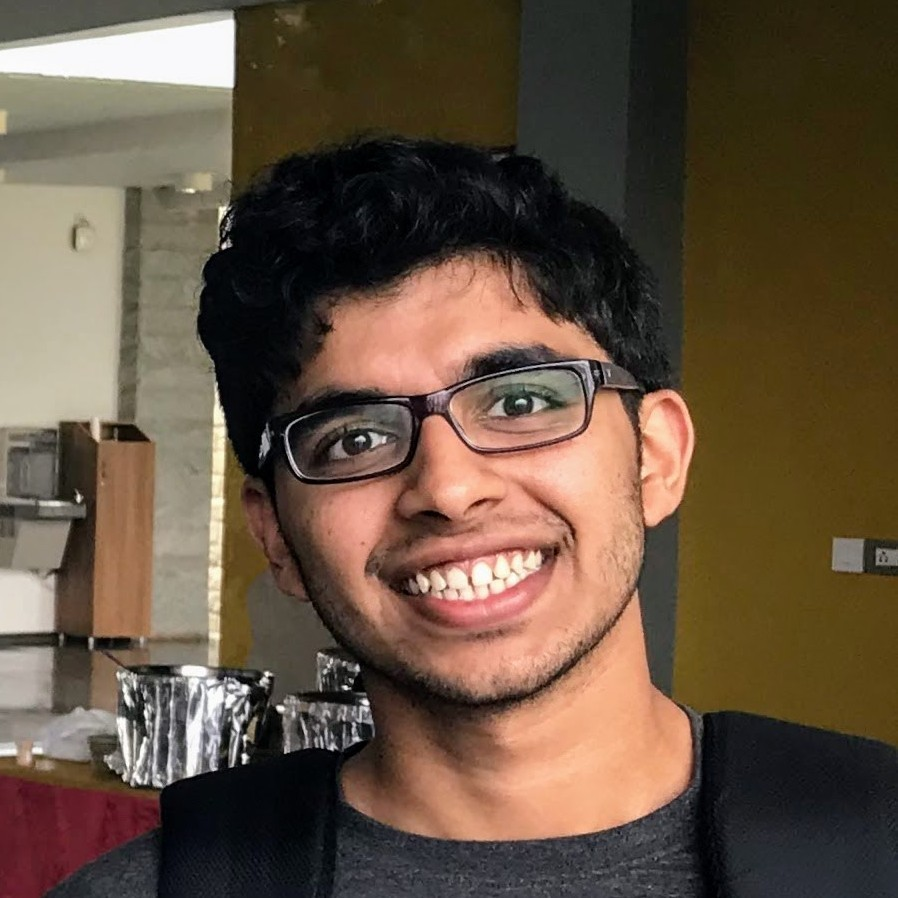

Title: About me
Date: 14/12/2017
Priority: 0

<table class="image">
<caption align="bottom">I look approximately like this.</caption>
<tr><td></td></tr>
</table>

 I am Sayantan Khan, a graduate student in Mathematics at the University of Michigan (and previously
 an undergraduate at Indian Institute of Science).  This website contains accounts of things I'm
 currently working on, along with details of some of my past work, both in pure mathematics, as well
 as other areas. I also maintain a [homepage](http://www-personal.umich.edu/~saykhan/) on the
 umich.edu domain.

You can have a look at my past projects and presentations by clicking on the
 relevant link on the navigation bar.

### Timeline
Here's a short description of some of the places I've been at since 2014.

- **June 2019:** I was at MSRI attending the summer school on [Random and arithmetic structures in
  topology](https://www.msri.org/summer_schools/853).
- **June 2019:** I was in Houston for the [Houston Summer School on Dynamical
  Systems](https://www.math.uh.edu/dynamics/school/school2019/).
- **August 2018 onwards:** Graduate student at the Mathematics department at University
of Michigan, Ann Arbor.
- **July 2018:** I was at IISER Pune attending the AIS on algebraic geometry.
- **February 2018:** I was at Freie Universität Berlin attending the [BMS Student
Conference](https://bmsstudconf.github.io/2018/index.html) and BMS Days.
- **November 2017:** I was at International Centre for Theoretical Sciences,
attending the [Geometry, Groups and
Dynamics](https://www.icts.res.in/program/ggd2017) program.
- **May - July 2017:** I was at University of Münster's Mathematics Department
as a DAAD-WISE Fellow.
- **January 2017:** I was at Chinese University of Hong Kong, attending the
[ITCSC-INC Winter School](http://www.itcsc.cuhk.edu.hk/Winter_School/Winter_School_2017/index.html).
- **July 2016:** I was at National Centre for Biological Sciences, attending
the [Physics of Life](https://theory.ncbs.res.in/physlife2016) Monsoon School.
- **August 2014 - April 2018**: Mathematics major at Indian Institute of Science.

### Quick links

These are some articles and notes I have written in the past which I'm too lazy to rewrite on my
blog. My [university homepage](http://www-personal.umich.edu/~saykhan/#notes) has a more up to date
list of articles.

- [Summary](pdfs/thesis_summary/thesis-summary.pdf) of my undergraduate final year project
which dealt with the Laplacian on Riemannian manifolds.
- [Notes](pdfs/ggd_notes/spherical_geometry.pdf) on spherical geometry I took
at GGD 2017.
- [Article](pdfs/articles/technical_results.pdf) containing some
  technical results in homotopy theory.
- [Article](pdfs/articles/weyls.pdf) on Weyl's equidistribution theorem.
- [Article](pdfs/articles/roths.pdf) on Roth's theorem on existence of
  three-term arithmetic progressions in positive density subsets of natural
  numbers.
